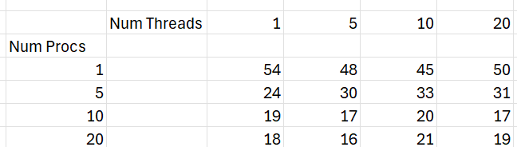
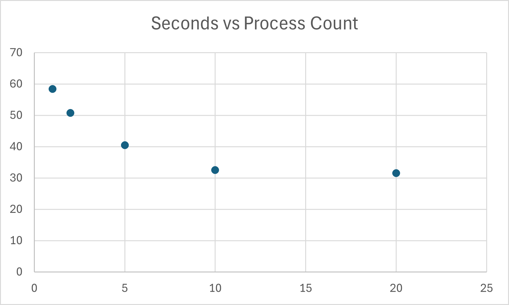

# System Programming Lab 11 Multiprocessing

## Introduction
 This mandelbrot plot is scaled down over 50 images and these images can be compiled with the ffmpeg using the command line:

    ffmpeg -i mandel%d.jpg mandel.mpg

## Results

#### Runtime vs. Procs

The graph represents the asymptotic behavior. The computer only has so many logical cores available to it, so as the number of processes is increased, the performance should hypothetically increase infinitely, however, the limitation of the cores results in the asymptotic behavior. 

It is important to note, that the first frames of the program take much more time than the later ones. Thus, the process who receives the first ones will take longer and the other processes have to wait. This affects the overall asymptotic performance. 

#### Additions of Threads
It appears that although threads increase performance, there is only a minor impact compared to the number of processes. This makes sense as each process handles one whole image, rather than breaking up an image into pieces. The performace make such a significant difference compared to splitting the image. 

## Sweet Spot
The sweet spot appeared around 5 processes and 5 threads. The most aggressive differences occurred between 1 down to 5 points. Beyond that, the processing difference was not as significant. 
